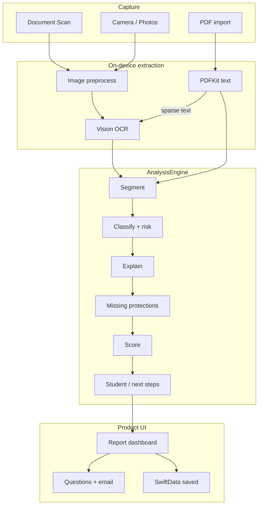

# CoParse

**On-the-spot contract safety for students, renters, and early-career workers.**

CoParse is a native **iOS** application that turns paper (or PDF) agreements into a structured, role-aware review: risky or unusual clauses, plain-English explanations, missing-protection checks, and questions to ask before you sign. The shipping product path runs **entirely on-device** — Vision OCR, heuristic analysis, SwiftData storage — with **no account, no upload, and no per-scan API cost**.

> **Educational information only — not legal advice.** CoParse does not tell you to sign or not sign. Always verify against the original document and seek a lawyer, legal aid, or campus clinic when stakes are high. See [`docs/PRODUCT.md`](docs/PRODUCT.md).

---

## Why CoParse exists

Most people sign leases, internship offers, and freelance agreements without reading them carefully — often with only a **paper copy** in hand. Dense legal language, time pressure, and asymmetric expertise make it easy to miss deposit rules, IP assignment, auto-renewal, or dispute clauses that matter later.

CoParse is built for that moment: scan pages on the spot, get a first-pass risk report in minutes, and walk away with concrete questions and an email draft — privately, offline, and free.

---

## What you get

| Area | What it does |
| --- | --- |
| **Capture** | VisionKit **Document Scan** (recommended), camera, Photos library, PDF import; reorder/delete pages before analyze |
| **Extraction** | Image preprocess → Apple **Vision** OCR; **PDFKit** text with OCR fallback for image-only PDFs |
| **Understanding** | Contract-type detection, clause segmentation, theme classification, risk tagging |
| **Guidance** | Plain-English explanations, missing protections, signature-readiness score, category bars, timeline, if/then nudges |
| **Action** | Questions to ask, copy-ready email templates, escalation pointers |
| **Persistence** | On-device **SwiftData** saves, optional auto-save, share as `.txt` report |
| **Product shell** | Disclaimer, onboarding, settings, privacy screen, App Icon, privacy manifest |

### Supported verticals

1. **Residential lease** — renter lens  
2. **Internship / job offer** — student intern lens  
3. **Freelance / contractor** — freelancer lens  
4. **Scan any** — confirm type and role when confidence is low  

---

## Repository layout

```text
CoParse/
├── ios/                 # Primary product — SwiftUI app + on-device engine
├── backend/             # Optional FastAPI reference API (demos / future sync)
├── docs/                # Product, architecture, API, deploy notes
├── TECHNICAL.md         # Deep technical design (pipelines, data, boundaries)
├── docker-compose.yml   # Local Postgres for optional backend
└── render.yaml          # Optional Render + Neon deploy
```

| Path | Role |
| --- | --- |
| [`ios/`](ios/) | Shipping client: SwiftUI UI, Vision/VisionKit/PDFKit, Swift heuristic engine, SwiftData |
| [`backend/`](backend/) | Optional upload → job → analysis API (Python pipeline mirrors iOS heuristics) |
| [`docs/PRODUCT.md`](docs/PRODUCT.md) | Positioning, privacy, free model, disclaimers |
| [`docs/ARCHITECTURE.md`](docs/ARCHITECTURE.md) | High-level flows |
| [`TECHNICAL.md`](TECHNICAL.md) | End-to-end technical specification |
| [`docs/API.md`](docs/API.md) | Optional REST endpoints |
| [`docs/DEPLOY_RENDER_NEON.md`](docs/DEPLOY_RENDER_NEON.md) | Free-tier API hosting |

---

## Architecture (overview)



The **optional backend** is a separate path (multipart upload → async job → JSON). The free iOS scan flow **does not call it**. Details: [`TECHNICAL.md`](TECHNICAL.md).

---

## Stack

| Layer | Technology |
| --- | --- |
| UI | SwiftUI, NavigationStack, custom navy theme |
| Capture | VisionKit `VNDocumentCameraViewController`, AVFoundation camera, PhotosPicker, file importer |
| OCR / PDF | Vision `VNRecognizeTextRequest`, Core Image preprocess, PDFKit |
| Analysis | Pure Swift heuristic pipeline under `ios/CoParse/Engine/` |
| Storage | SwiftData (`SavedAnalysis`), UserDefaults preferences |
| Privacy | On-device default path; `PrivacyInfo.xcprivacy` (no tracking) |
| Optional API | FastAPI, SQLAlchemy, Alembic, PostgreSQL / SQLite |
| Optional infra | Docker Compose, Render, Neon |

**Requirements (iOS):** Xcode 15+, iOS 17+, Apple Developer team for device/signing. Physical device recommended for Document Scan.

**Requirements (optional backend):** Python 3.11+, Docker (Postgres), Git.

---

## Quick start — iOS (recommended)

1. Clone this repository.
2. Open [`ios/CoParse.xcodeproj`](ios/CoParse.xcodeproj) in Xcode.
3. Select the **CoParse** scheme and an iPhone simulator or device.
4. Set **Signing → Team** (bundle id `com.coparse.app`).
5. Build and run (`⌘R`).
6. On a device, grant **Camera** / **Photos** when prompted.

### User flow

1. Accept the educational disclaimer  
2. Complete short onboarding  
3. Choose a vertical (or “scan any”)  
4. Capture / import pages → reorder or delete as needed  
5. **Analyze on device**  
6. Confirm type/role if confidence is low  
7. Review the report → questions / email → save or share  

More iOS notes: [`ios/README.md`](ios/README.md).

---

## Quick start — optional backend

Use this only for demos, portfolio deploys, or future sync — **not** required for scanning in the app.

```bash
docker compose up -d
cd backend
python -m venv .venv
source .venv/bin/activate          # Windows: .venv\Scripts\activate
pip install -r requirements.txt
cp ../.env.example .env
alembic upgrade head
uvicorn app.main:app --reload --host 0.0.0.0 --port 8000
```

| Resource | URL |
| --- | --- |
| API | http://localhost:8000 |
| OpenAPI | http://localhost:8000/docs |
| Deploy | [`docs/DEPLOY_RENDER_NEON.md`](docs/DEPLOY_RENDER_NEON.md) |

### API surface (summary)

| Method | Path | Purpose |
| --- | --- | --- |
| `POST` | `/v1/documents` | Upload file + optional type/role hints |
| `GET` | `/v1/jobs/{id}` | Poll job status |
| `GET` | `/v1/documents/{id}/analysis` | Fetch analysis JSON |
| `POST` | `/v1/documents/{id}/reanalyze` | Re-run with confirmed type/role |

Full contract: [`docs/API.md`](docs/API.md).

---

## On-device analysis pipeline

The Swift engine ports the same stages as `backend/app/pipeline/`:

| Stage | Module | Responsibility |
| --- | --- | --- |
| Segment | `Segment.swift` | Split text into clause-sized chunks (headers / paragraphs / windows) |
| Classify | `Classify.swift` | Detect contract type; theme + risk level per clause |
| Explain | `Explain.swift` | Plain English, compare note, questions, negotiability |
| Missing | `Missing.swift` | Template checks for absent protections per vertical |
| Score | `Score.swift` | Overall 0–100 + category scores + readiness key |
| Student | `Student.swift` | Role checklists, if/then nudges, email + escalation |
| Orchestrate | `AnalysisEngine.swift` | Confidence, timeline, top issues, `AnalysisResult` |

Confidence considers text length, segment count, character quality, and **OCR mean confidence**. Low confidence (or “scan any”) routes through the confirm screen before the report.

---

## Privacy, free model, and shipping

| Topic | Policy |
| --- | --- |
| Default analysis | On-device only; contract images/text are not uploaded |
| Accounts | None required |
| Ads | None in this release |
| User cost | Free |
| Operator runtime | $0 for on-device path (no LLM/OCR bill) |
| Distribution | Apple Developer Program (~$99/year) for TestFlight / App Store |
| Privacy manifest | [`ios/CoParse/PrivacyInfo.xcprivacy`](ios/CoParse/PrivacyInfo.xcprivacy) |

Product positioning and evaluation guidance: [`docs/PRODUCT.md`](docs/PRODUCT.md).

---

## Documentation index

| Document | Contents |
| --- | --- |
| **[TECHNICAL.md](TECHNICAL.md)** | Full technical design: components, data models, OCR, engine math, API, boundaries |
| [docs/PRODUCT.md](docs/PRODUCT.md) | Product definition, disclaimers, privacy |
| [docs/ARCHITECTURE.md](docs/ARCHITECTURE.md) | Concise architecture overview |
| [docs/API.md](docs/API.md) | Optional REST API |
| [docs/DEPLOY_RENDER_NEON.md](docs/DEPLOY_RENDER_NEON.md) | Render + Neon deploy |
| [ios/README.md](ios/README.md) | Xcode / signing notes |
| [backend/README.md](backend/README.md) | Backend setup and tests |

---

## License

TBD.
