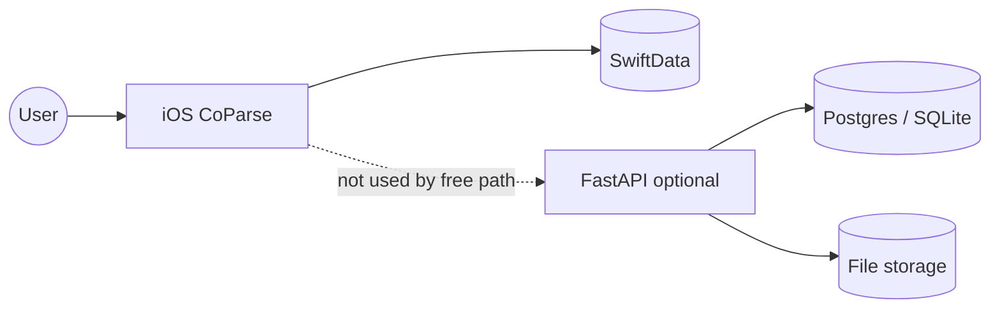
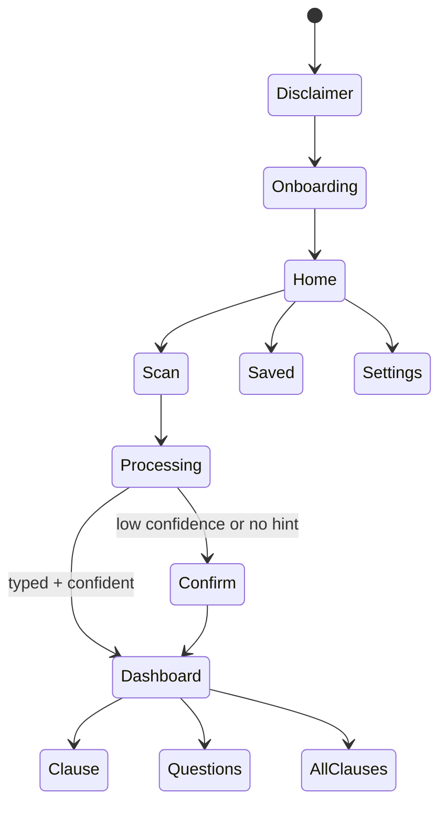
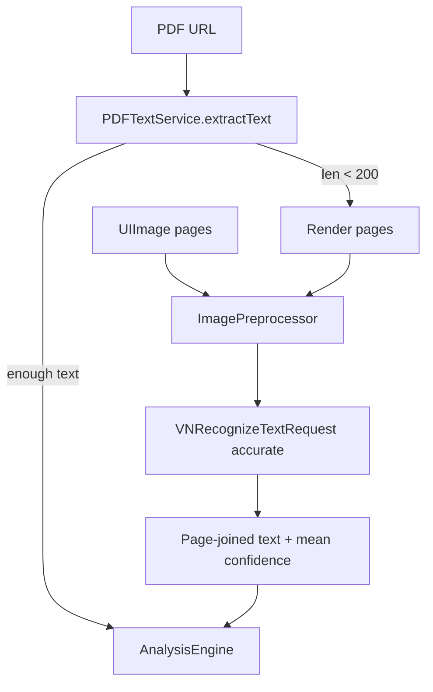
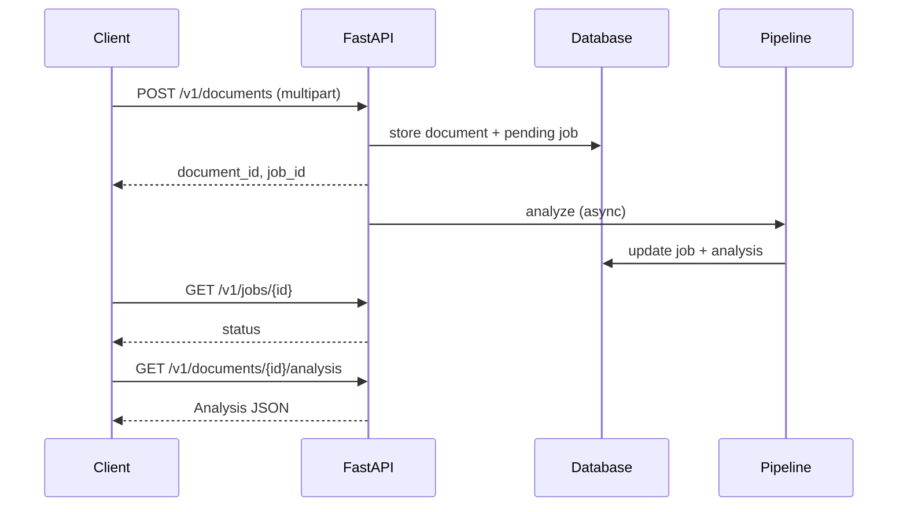

# CoParse — Technical Design

This document is the technical companion to the product README. It describes how the **shipping iOS on-device path** works, how the **optional FastAPI backend** mirrors it, and where boundaries sit for privacy, cost, and future sync.

> Educational tooling — not legal advice. Analysis can miss or misread text (especially OCR). See [`docs/PRODUCT.md`](docs/PRODUCT.md).

---

## 1. System context

CoParse is a monorepo with two runnable surfaces:

| Surface | Path | Role |
| --- | --- | --- |
| **iOS app (primary)** | `ios/` | Capture → OCR/PDF → heuristic analysis → report → local save/share |
| **Optional API** | `backend/` | Upload → async job → Python pipeline → JSON (demos / future sync) |



**Invariant:** the free product path never requires network, accounts, or cloud OCR/LLM calls.

---

## 2. iOS application structure

```text
ios/CoParse/
├── CoParseApp.swift          # @main, SwiftData container
├── AppModel.swift            # Navigation + analysis orchestration
├── Info.plist / PrivacyInfo.xcprivacy
├── Theme/                    # Colors, typography
├── Models/                   # AnalysisResult, SavedAnalysis
├── Services/                 # OCR, PDF, camera, document scanner, preprocess, export
├── Engine/                   # Heuristic pipeline (Swift port of backend/pipeline)
└── Views/                    # Disclaimer → … → Report / Settings / Privacy
```

### 2.1 Navigation and state

`AppModel` owns:

- `path: [AppRoute]` — stack routes (`scan`, `processing`, `confirm`, `dashboard`, …)
- Capture buffers: `pendingImages`, `pendingPDFURL`
- Analysis: `currentResult`, progress, OCR confidence, errors
- Preferences: disclaimer/onboarding flags, auto-save (`UserDefaults`)
- `pendingAutoSave` — one-shot flag so reopening a saved report does not duplicate

Flow:



### 2.2 Capture services

| Service | Responsibility |
| --- | --- |
| `DocumentScanner.swift` | VisionKit multi-page document camera (preferred) |
| `CameraCapture.swift` | Single/multi photo via UIImagePicker / permission helper |
| PhotosPicker | Library import (up to 30 images) |
| File importer | PDF → temp copy with security-scoped access |
| Scan UI | Reorder (`onMove`) and delete pages before analyze |

### 2.3 Extraction pipeline



**OCR settings:** recognition level `.accurate`, language correction on, automatic language detection (iOS 16+). Observations are sorted top-to-bottom, left-to-right for reading order.

**Preprocess:** Core Image mono + contrast boost to stabilize Vision on phone photos.

**Guardrail:** if extracted text is shorter than ~40 non-whitespace characters, analysis aborts with a rescan message.

---

## 3. Analysis engine (Swift)

Orchestrator: `Engine/AnalysisEngine.swift`  
Stages align with `backend/app/pipeline/{segment,classify,explain,missing,score,student,analyze}.py`.

### 3.1 Pipeline stages

| Order | Module | Input → Output |
| --- | --- | --- |
| 1 | `Segment` | Full text → clause chunks (max 80) |
| 2 | `Classify` | Chunk → theme + risk; full text → contract type |
| 3 | `Explain` | Chunk + theme/risk/type/role → plain English, questions |
| 4 | `Missing` | Type + full text → missing protection list |
| 5 | `Score` | Clauses + missing → overall, categories, readiness key |
| 6 | `Student` | Type/role/issues → journey checklist, next steps |
| 7 | Engine wrap | Confidence, timeline, top issues, `AnalysisResult` |

### 3.2 Segmentation strategy

1. Prefer regex splits on `Section N`, numbered headings, or ALL-CAPS headers  
2. Else split on blank lines (length filter)  
3. Else sliding windows (~2000 chars, ~200 overlap)  

Short/noisy OCR often falls through to (2) or (3); confidence scoring reflects that.

### 3.3 Classification and risk

**Contract types:** `lease`, `internship_offer`, `freelance`, `unknown` (unknown defaults to lease for scoring if still unresolved after confirm).

**Themes:** payment, termination, IP, confidentiality, disputes, renewal, deposit, maintenance, subletting, scope, indemnity, general.

**Risk heuristics (examples):**

- High: aggressive phrases (`sole discretion`, `perpetual`, `binding arbitration`, lease red flags, …)
- Medium: vague long clauses; IP / indemnity / disputes themes; money / termination / deposit themes
- Else: low  

Keywords and patterns live in `Classify.swift` and should stay behaviorally close to `backend/app/pipeline/classify.py`.

### 3.4 Scoring

`Score.swift` starts from a base (~85) and category baselines (~80), then:

- Subtracts per high/medium clause (theme-routed into money / termination / ip_privacy / disputes / flexibility)
- Subtracts for each missing protection  
- Clamps categories and overall  
- Maps overall → readiness: `mostly_standard` (≥75), `worth_clarifying` (≥55), `caution` (≥40), `strongly_consider_review`

Scores are **educational signals**, not legal grades.

### 3.5 Analysis confidence

`analysisConfidence` combines:

- Short extracted text  
- Few segments  
- Low alphabetic ratio (OCR noise)  
- Low OCR mean confidence (&lt; 0.45)  
- Presence of contract-like vocabulary (boost)

Levels: `high` / `medium` / `low`. Low OCR or unspecified type triggers **Confirm**.

### 3.6 Result model

`AnalysisResult` (Codable) is the single UI + persistence payload:

- Identity: id, title, createdAt, source (`scan` | `pdf` | `text`)
- Typing: contractType, role  
- Scoring: overallScore, signatureReadiness, categoryScores  
- Quality: analysisConfidence, ocrConfidence, limitations  
- Content: topIssues, clauses, missingProtections, questionsToAsk, timeline  
- Guidance: studentJourney, nextSteps  
- Fidelity: `extractedText` retained for re-analyze after confirm  

`SavedAnalysis` (SwiftData) stores metadata + `payloadJSON` blob for offline reopen.

---

## 4. Product UI map

| View | Purpose |
| --- | --- |
| `DisclaimerView` | Mandatory educational gate + privacy sheet |
| `OnboardingView` | Scan / privacy / report / questions tips |
| `HomeView` | Verticals + scan any + saved + settings |
| `ScanView` | Capture, page edit, analyze CTA |
| `ProcessingView` | Progress + error recovery |
| `ConfirmView` | Type + role when needed |
| `DashboardView` | Score, categories, issues, timeline, if/then, save/share |
| `ClauseDetailView` | Full clause card |
| `AllClausesView` | Filtered clause browser |
| `QuestionsView` | Questions, email copy, escalation |
| `SavedView` | List / delete / reopen |
| `SettingsView` / `PrivacyView` | Preferences and privacy copy |

Export: `ReportExporter` builds a plain-text report and shares via `UIActivityViewController` (file + text).

---

## 5. Optional backend

### 5.1 Responsibilities

- Accept PDF/TXT uploads  
- Persist document + job rows  
- Run `pipeline/analyze.py` asynchronously  
- Serve analysis JSON for polling clients  

**Not** used by the free iOS scan path.

### 5.2 Request flow



### 5.3 Pipeline parity

| Python | Swift |
| --- | --- |
| `segment.py` | `Segment.swift` |
| `classify.py` | `Classify.swift` |
| `explain.py` | `Explain.swift` |
| `missing.py` | `Missing.swift` |
| `score.py` | `Score.swift` |
| `student.py` | `Student.swift` |
| `analyze.py` | `AnalysisEngine.swift` |
| `extract.py` | PDFKit + Vision (iOS-only capture) |

Backend may optionally call an LLM for explanations when configured; **iOS free path does not**.

### 5.4 API endpoints

See [`docs/API.md`](docs/API.md). Auth is intentionally absent for open demos — add tokens before public exposure.

### 5.5 Local / deploy

- Local: `docker-compose.yml` + Alembic + Uvicorn  
- Cloud: `render.yaml` + Neon — [`docs/DEPLOY_RENDER_NEON.md`](docs/DEPLOY_RENDER_NEON.md)

---

## 6. Privacy and security boundaries

| Concern | Design |
| --- | --- |
| Contract content (free path) | Stays on device (memory + optional SwiftData) |
| Network | Not required for scan/analyze/save/share |
| Tracking | `NSPrivacyTracking = false`; no collected data types declared |
| UserDefaults | Preferences only (`CA92.1`) |
| Camera / Photos | Usage strings in `Info.plist` |
| Logging | Do not log full contract text |
| Optional API keys | Server-side only if cloud enrich is enabled later |

---

## 7. Cost model (technical)

| Path | Runtime cost drivers |
| --- | --- |
| On-device iOS | Device CPU/Neural Engine only — $0 operator OCR/LLM |
| Optional API | Host + DB + storage; avoid paid OCR/LLM for free demos |
| Distribution | Apple Developer Program for TestFlight / App Store |

---

## 8. Testing and evaluation

**Backend:** `cd backend && pytest` (pipeline + API tests as present).

**iOS:** Xcode build on simulator/device; exercise Document Scan on hardware; verify OCR on photo vs PDF; confirm low-confidence confirm path; save/reopen/share.

**Evaluation set (recommended):** rights-cleared synthetic leases/offers/freelance samples; track regressions on segment count, risk tags, and score drift when changing heuristics. Never train on user documents without consent.

---

## 9. Configuration cheat sheet

| Item | Value |
| --- | --- |
| Bundle ID | `com.coparse.app` |
| Deployment target | iOS 17 |
| Marketing version | 1.0 |
| Xcode project | `ios/CoParse.xcodeproj` |
| Scheme | `CoParse` |
| Optional API port | `8000` |

---

## 10. Related docs

- [`README.md`](README.md) — product + quick start  
- [`docs/ARCHITECTURE.md`](docs/ARCHITECTURE.md) — short overview  
- [`docs/PRODUCT.md`](docs/PRODUCT.md) — product policy  
- [`docs/API.md`](docs/API.md) — REST details  
- [`ios/README.md`](ios/README.md) — Xcode notes  
- [`backend/README.md`](backend/README.md) — backend setup  
