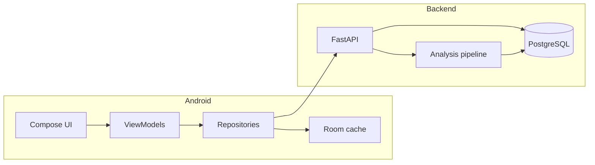

# Architecture

- **Client:** MVVM; Retrofit calls `/v1/*`; Room stores recent analyses and starred clauses for offline viewing.
- **Server:** Uploads stored on disk (`STORAGE_PATH`); metadata and analysis in PostgreSQL; processing runs in-process (async task) with job rows for status polling.

See also: [API.md](API.md), [PRODUCT.md](PRODUCT.md).
